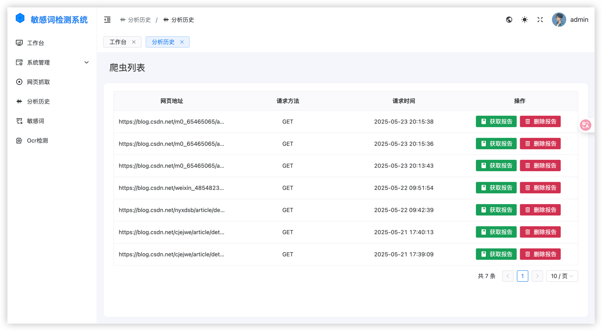
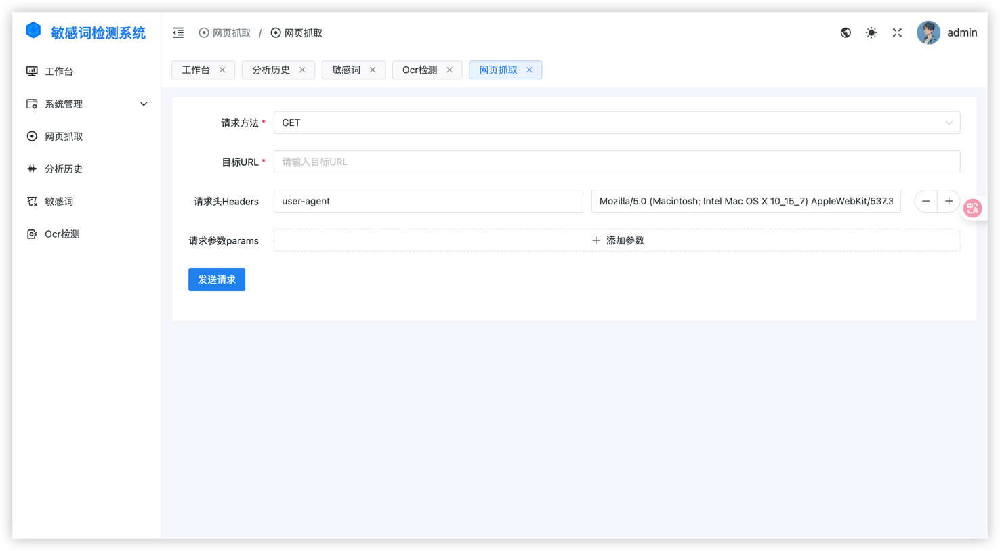
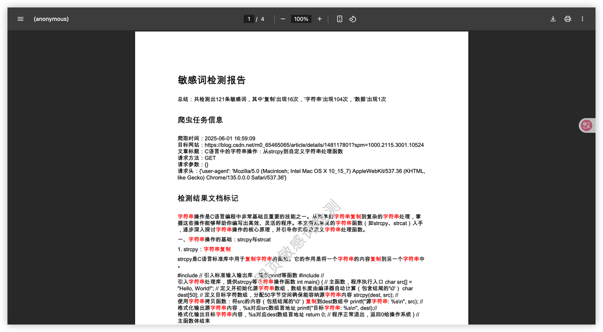

# 网页敏感词检测系统

## 项目介绍

这是一个基于 FastAPI 和 Vue 开发的网页敏感词检测系统，提供了敏感词管理和文本内容检测功能。系统支持多级别敏感词分类，可以灵活配置敏感词的启用状态，适用于网站内容审核、文本过滤等场景。页面运行截图如下:

<div align="center">
  <div style="display: flex; justify-content: center; margin-bottom: 20px;">
    
    
  </div>
  <div style="display: flex; justify-content: center; margin-bottom: 20px;">
    
    
  </div>
  <div style="display: flex; justify-content: center; margin-bottom: 20px;">
    
    
  </div>
  <div style="display: flex; justify-content: center;">
    
  </div>
</div>

## 功能特性

- 敏感词管理
  - 支持添加、编辑、删除敏感词
  - 敏感词分类管理
  - 支持 1-3 级敏感词等级设置
  - 敏感词状态切换（启用/禁用）
- 文本检测
  - 批量文本内容检测
  - 实时检测响应
  - Ocr 识别检测
  - 输入网址配置请求参数检测
- 系统管理
  - 用户权限管理
  - API 接口管理
  - 系统日志记录

## 技术栈

### 后端

- Python 3.x
- FastAPI：高性能的异步 Web 框架
- SQLAlchemy：ORM 框架
- Pydantic：数据验证
- JWT：身份认证

### 前端

- Vue.js：前端框架
- Vite：构建工具
- UnoCSS：原子化 CSS 框架

## 快速开始

### 环境要求

- Python 3.11
- Node.js 18+
- MySQL 8.0+

### 安装步骤

1. 克隆项目

```bash

git clone https://github.com/zrqg-znb/sensitiveWordsDetection.git
cd SensitiveDetection
```

2. 后端环境配置

```bash

# 安装依赖
pip install -r requirements.txt

# 配置数据库
# 修改 app/settings/config.py 中的数据库配置
# 修改阿里云oss参数
# 修改 app/utils/oss_config.py 中的配置

# 运行迁移
python run.py
```

3. 前端环境配置

```bash

cd web
pnpm install
pnpm dev
```

## 使用说明

1. 敏感词管理

   - 在系统中添加敏感词，设置分类和级别
   - 可以通过切换状态来控制敏感词是否生效

2. 文本检测
   - 通过 API 接口发送待检测的文本列表
   - 系统将返回检测结果

## API 文档

启动服务后访问 `127.0.0.1:9999/docs` 查看详细的 API 文档。

## 贡献指南

欢迎提交 Issue 和 Pull Request。

## 定制开发

若有其他功能定制开发可扫码添加作者，备注来意。


